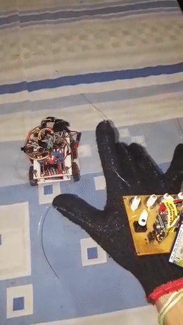

# Bioglove: Prototype of a bioinspired flexion transducer 
A project used in my undergraduate thesis [pt-br] 

# Abstract
Gloves embedded with sensors, also known as data gloves, allow interactions with virtual reality, robotics, control, internet of things, telemedicine, and so on. Essentially, such interaction occurs through the mapping of hands position as well as the flexion degree of the fingers for certain movements and actions within the environment in which the glove is submitted. The cost of the glove in many projects becomes prohibitive because of the technology chosen for such mapping. In the specific case of measuring the degree of flexion of the fingers — there are solutions based on fiber optics, conductive ink, resistive bending sensors and potentiometers. In order to reduce the cost of projects that require a data glove, was developed the BioGlove: a generic glove with low-cost embedded flexion sensors inspired by finger biomechanics. For the control and communication of the glove, a microcontroller board that has wide documentation and availability was used and a simplified protocol of communication and control was developed. The prototype developed was used for wireless control of an electronic car and its performance was compared with commercial solutions documented in the literature. The results showed that the BioGlove performs similarly to its competitors, especially in the flexion mapping and energy consumption requirements.

# Thesis
A .pdf version of the complete undergraduate thesis [pt-br] can be found .

# Note
This project was also known as Low Cost Flex Sensor (lcfs)

# Issues
Some archives are missing and they will be uploaded as soon as possible
